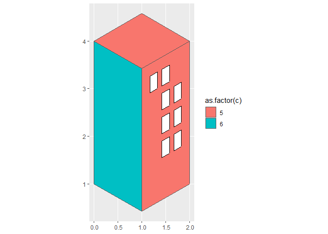
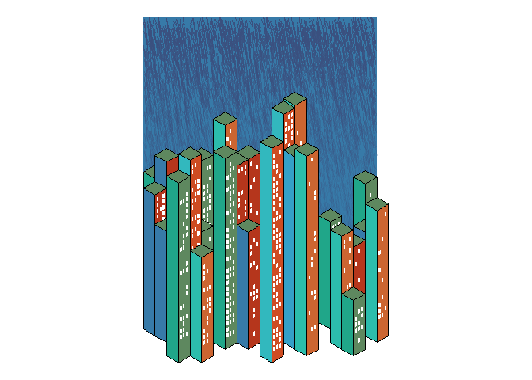
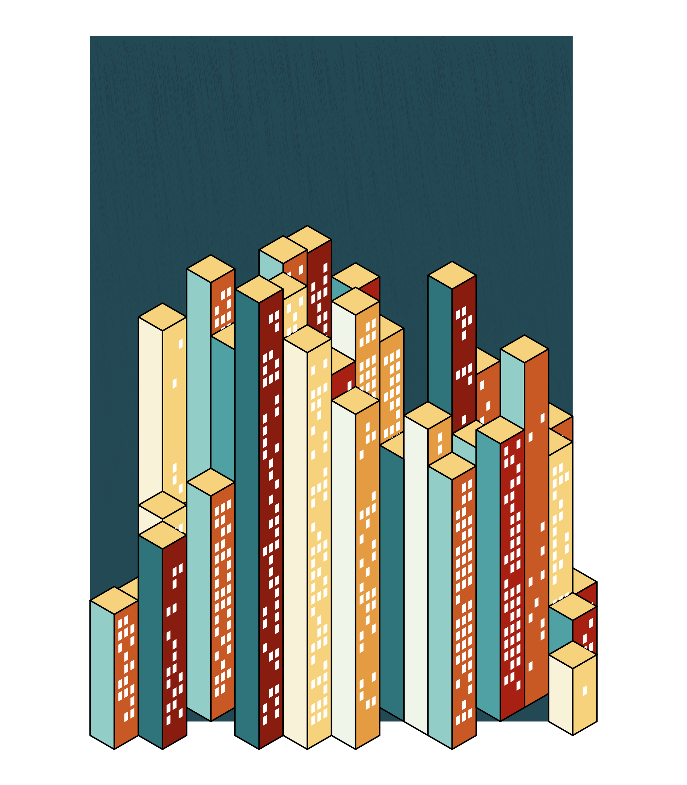

<!-- README.md is generated from README.Rmd. Please edit that file -->

# Skylines

<!-- badges: start -->
<!-- badges: end -->

This repository holds a system that I developed for Genuary 2022 and
that I am
[revisiting](https://github.com/paezha/genuary2022/tree/master/09-architecture)
just for kicks. The system uses simple features to create cartoonish
skylines in colorful styles.

For this system I use the following packages:

``` r
library(dplyr) # A Grammar of Data Manipulation
library(ggplot2) # Create Elegant Data Visualisations Using the Grammar of Graphics
library(glue) # Interpreted String Literals
library(MexBrewer) # Color Palettes Inspired by Works of Mexican Muralists
library(sf) # Simple Features for R
```

## The basic mechanics of creating a tower

First I need to decide a position for the block that will become a
tower:

``` r
x_o <- 20
y_o <- 10
```

Then, this is the height of the block:

``` r
l <- 4
```

The block has several parts, essentially the visible faces from the
vantage point of the viewer:

``` r
# Create a matrix with the coordinates of the polygon that becomes the right face of the block
right_face <- matrix(c(x_o + 1, y_o, # From the coordinates of the block, displace one unit right
                       x_o, y_o - 1 * tan(pi/6), # Displace the y-coordinate to the left a distance 1 * tan(pi/6)
                       x_o, y_o - 1 * tan(pi/6) + l, # Displace the y-coordinate to the left and up to the height l 
                       x_o + 1, y_o + l, # Displace the coordinates one unit to the right and l up
                       x_o +1, y_o), # Return to starting point
                     ncol = 2,
                     byrow = TRUE)

# Create a matrix with the coordinates of the polygon that becomes the left face of the block
left_face <- matrix(c(x_o - 1, y_o, 
                      x_o, y_o - tan(pi/6), 
                      x_o, y_o - tan(pi/6) + l, 
                      x_o - 1, y_o + l, 
                      x_o - 1, y_o),
                    ncol = 2,
                    byrow = TRUE)

# Create a matrix with the coordinates of the polygon that becomes the top of the block
top <- matrix(c(x_o - 1, y_o + l,
                x_o, y_o + tan(pi/6) + l, 
                x_o + 1, y_o + l, 
                x_o, y_o - tan(pi/6) + l, 
                x_o - 1, y_o + l),
              ncol = 2,
              byrow = TRUE)

# Random number that can be used to assign colors
c <- sample.int(5, 1)

# Convert coordinates to polygons and then to simple features
rp <- data.frame(c = c,
                 geometry = st_polygon(list(right_face)) |> 
                   st_sfc()) |> 
  st_as_sf()
lp <- data.frame(c = 11 - c,
                 geometry = st_polygon(list(left_face)) |> 
                   st_sfc()) |> 
  st_as_sf()

top <- data.frame(c = 5,
                  geometry = st_polygon(list(top)) |> 
                    st_sfc()) |> 
  st_as_sf()

# Put all faces together
faces <- rbind(rp, lp, top)
```

Plot this single block:

``` r
ggplot() + 
  geom_sf(data = faces, aes(fill = as.factor(c)))
```

<!-- -->

Make a function to create a block (and add windows):

``` r
tower <- function(x_o, y_o, l, s){
  # x_o and y_o are the coordinates to place the tower
  # l is the height of the tower
  # s is the sampling rate for the windows
  # y_o pulls the bottom of the tower to a minimum value of y if provided, otherwise the coordinate supplied
  
  # Right face of tower
  right_face <- matrix(c(x_o + 1, y_o, 
                         x_o, y_o - tan(pi/6), 
                         x_o, y_o - tan(pi/6) + l, 
                         x_o + 1, y_o + l, 
                         x_o +1, y_o),
                       ncol = 2,
                       byrow = TRUE)
  # Left face of tower
  left_face <- matrix(c(x_o - 1, y_o, 
                        x_o, y_o - tan(pi/6), 
                        x_o, y_o - tan(pi/6) + l, 
                        x_o - 1, y_o + l, 
                        x_o - 1, y_o),
                      ncol = 2,
                      byrow = TRUE)
  # Top of tower
  top <- matrix(c(x_o - 1, y_o + l,
                  x_o, y_o + tan(pi/6) + l, 
                  x_o + 1, y_o + l, 
                  x_o, y_o - tan(pi/6) + l, 
                  x_o - 1, y_o + l),
                ncol = 2,
                byrow = TRUE)
  
  # Windows
  
  # Grid for windows
  x_w <- x_o + 1/4
  y_w <- seq(y_o + 0.5, 
             y_o + l - 1, 
             0.5) # vertical spacing between windows
  
  df_w <- data.frame(expand.grid(x = x_w, 
                                 y = y_w))
  df_w <- rbind(df_w,
                mutate(df_w, 
                       x = x + 1/4, # horizontal spacing between windows
                       y = y + 1/4 * tan(pi/6)),
                mutate(df_w, 
                       x = x + 2/4, # horizontal spacing between windows
                       y = y + 2/4 * tan(pi/6)))
  df_w <- slice_sample(df_w, prop = s)
  
  s_window <- data.frame()
  
  for(i in 1:nrow(df_w)){
    w <- matrix(c(df_w[i, 1] + 0.08, df_w[i, 2], # half the width of the window added to the x coordinate
                       df_w[i, 1] - 0.08, df_w[i, 2] - 0.16 * tan(pi/6), # width of window to translate y coordinate
                       df_w[i, 1] - 0.08, df_w[i, 2] - 0.16 * tan(pi/6) + 0.35, # height of window 
                       df_w[i, 1] + 0.08, df_w[i, 2] + 0.35, 
                       df_w[i, 1] + 0.08, df_w[i, 2]),
                       ncol = 2,
                       byrow = TRUE)
    # Convert to simple features
    w <- data.frame(c = 5,
                   geometry = st_polygon(list(w)) |> 
                     st_sfc()) |> 
    st_as_sf()
    s_window <- rbind(s_window, 
                     w)
  }
  
    # Add value for colors
  c <- sample.int(5, 1)
  
  # Convert to simple features
  rp <- data.frame(c = c,
                   geometry = st_polygon(list(right_face)) |> 
                     st_sfc()) |> 
    st_as_sf()
  lp <- data.frame(c = 11 - c,
                   geometry = st_polygon(list(left_face)) |> 
                     st_sfc()) |> 
    st_as_sf()
  
  top <- data.frame(c = 5,
                    geometry = st_polygon(list(top)) |> 
                      st_sfc()) |> 
    st_as_sf()
  
  # Complete tower
  tower <- rbind(rp, lp, top)
  return(list(tower, s_window))
}
```

Create a single tower with the function defined above:

``` r
t1 <- tower(1, 1, l = 3, s = 2/3)
```

Plot this tower:

``` r
ggplot() + 
  geom_sf(data = t1[[1]], 
          aes(fill = as.factor(c))) + 
  geom_sf(data = t1[[2]], 
          fill = "white", 
          color = "black")
```

<!-- -->

## Create a skyline

Randomly sample a number for the random seed:

``` r
seed <- sample.int(1, n = 1000000)
```

Generate grid for placing towers:

``` r
n_cols <- 20
n_rows <- 5

# Grid - odd rows
df_o <- data.frame(expand.grid(x = seq(1, 
                                       n_cols,
                                       by = 2), 
                               y = seq(1, 
                                       n_rows, 
                                       by = 2 * tan(pi/6))), 
                   r = "odd")

# Grid - even rows
df_e <- data.frame(expand.grid(x = seq(2, 
                                       n_cols + 1, 
                                       by = 2), 
                               y = seq(1 + tan(pi/6),
                                       n_rows, 
                                       by = 2 * tan(pi/6))),
                   r = "even")

# Bind
df <- rbind(df_o, df_e)
```

Sample from the grid:

``` r
set.seed(seed)

df <- df |>
  slice_sample(prop = 0.5)
```

Create the towers in such an order that the groups go from left to right
and from bottom to top:

``` r
# Initialize the skyline and window objects
skyline <- data.frame()
all_windows <- data.frame()

# Arrange the grid points from front to back
df <- df |>
  group_by(y) |>
  arrange(desc(y)) |>
  ungroup() |>
  as.data.frame()

# Create one tower for each sampled point in the grid; the height of the tower is random
for(i in 1:nrow(df)){
  t1 <- tower(df[i, 1], 
              df[i, 2], 
              l = 0.25 * (-1/3 * (df[i, 1] - n_cols/2)^2 + 40) + runif(1,
                                                                     min = 0, 
                                                                     max = 10),
              s = runif(1, 
                        min = 0.1, 
                        max = 0.8)
              )
  skyline <- rbind(skyline, 
                   data.frame(t1[[1]], group = i))
  
  all_windows <- rbind(all_windows, 
                   data.frame(t1[[2]], group = i))
}

# Convert to simple features:
skyline <- skyline |>
  #arrange(desc(group)) |>
  st_as_sf()

all_windows <- all_windows |>
  #arrange(desc(group)) |>
  st_as_sf()
```

Clip the simple feature objects in the same order to remove parts of the
towers that are “behind” other towers and are therefore not in sight:

``` r
# Copy original skyline
skyline2 <- skyline
all_windows2 <- all_windows

# Number of towers
max_groups <- max(skyline2$group)

# Initialize table for clipped towers
clipped_towers <- data.frame()

# Initialize table for clipped towers
clipped_windows <- data.frame()

for(i in 1:max_groups - 1){
  
  # Get current tower
  current_towers <- skyline2 |>
    filter(group == i)

  # Get windows of current tower
  current_windows <- all_windows2 |>
    filter(group == i)

  # Remove current tower from skyline
  skyline2 <- skyline2 |> 
    filter(group != i)

  # Remove windows of current tower from all windows
  all_windows2 <- all_windows2 |> 
    filter(group != i)
    
  # Clip current tower using rest of skyline
  clipped_towers <- rbind(clipped_towers,
                         current_towers |>
                           st_difference(skyline2 |> 
                                           st_union()))
  
  # Clip windows of current tower using rest of skyline
  clipped_windows <- rbind(clipped_windows,
                         current_windows |>
                           st_difference(skyline2 |> 
                                           st_union()))
}

# Add the last tower which was not clipped
clipped_towers <- rbind(clipped_towers,
                       skyline2)

clipped_windows <- rbind(clipped_windows,
                       all_windows2)
```

To prettify the scene, create a data frame for probabilistic hatching:

``` r
set.seed(seed)

# Create an initial cloud of points for hatching
df_hatch <- data.frame(x = runif(10000, 
                                 min = min(df$x) - 1, 
                                 max = max(df$x) + 1),
                       y = runif(10000,
                                 min = min(df$y) + tan(pi/6),
                                 max = 30)) |>
  # Calculate endpoints for the line segments that will produce the hatching
  mutate(xend = x + 0.2,
         yend = y - runif(n(), 
                          min = 0.25, max = 2 + runif(n(), 
                                                      min = 0.2, 
                                                      max = 0.2)))
```

Plot clipped towers:

``` r
set.seed(seed)

palettes <- c("Alacena", "Atentado", "Aurora", "Concha", "Frida", "Revolucion", "Ronda", "Tierra")

col_palette <- mex.brewer(sample(palettes, 1), n = max(clipped_towers$c) + 2)

min_y <- df |> 
  filter(x == min(x)) |> 
  filter( y == min(y)) |>
  pull(y)

ggplot() + 
  # This is the background of the image
  geom_rect(aes(xmin = min(df$x) - 1, 
            xmax = max(df$x), 
            ymin = min_y + tan(pi/6), 
            ymax = 30),
            fill = col_palette[length(col_palette) - 1]) + 
  # This is the probabilistic hatching
  geom_segment(data = df_hatch |>
                 filter(xend > 0 & xend < n_cols, 
                        yend > (min_y + tan(pi/6)) & yend < 30),
               aes(x = x, 
                   y = y,
                   xend = xend,
                   yend = yend,
                   alpha = (y/30)^4),
               color = col_palette[length(col_palette)],
               size = 0.1) + 
  # These are the towers
  geom_sf(data = clipped_towers, 
          aes(fill = factor(c)),
          color = "black") +
  # These are the windows
  geom_sf(data = clipped_windows,
          fill = "white",
          color = NA) +
  # Use the selected palette to color the towers
  scale_fill_manual(values = col_palette) + 
  theme_void() +
  theme(legend.position = "none")
```

<!-- -->

``` r

# Save image
ggsave(glue("outputs/skyline-{seed}.png"),
       #width = 8,
       height = 8,
       units = "in")
#> Saving 7 x 8 in image
```

<!-- -->
